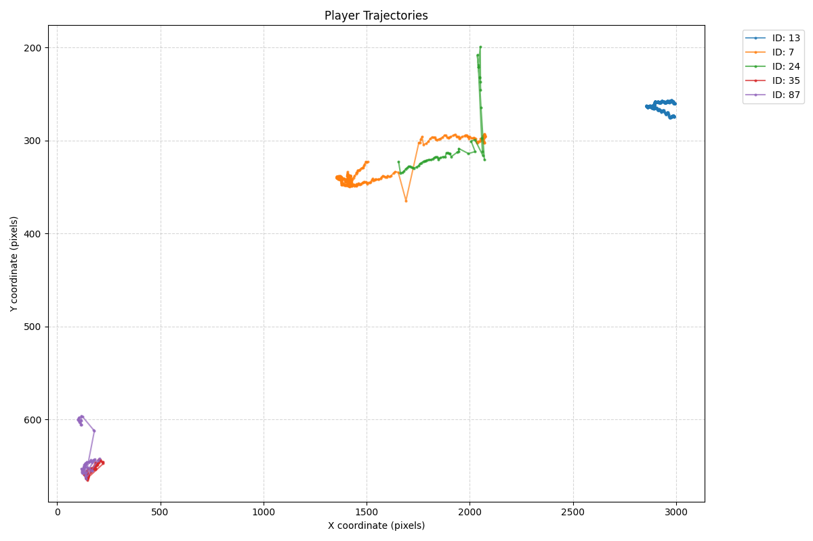
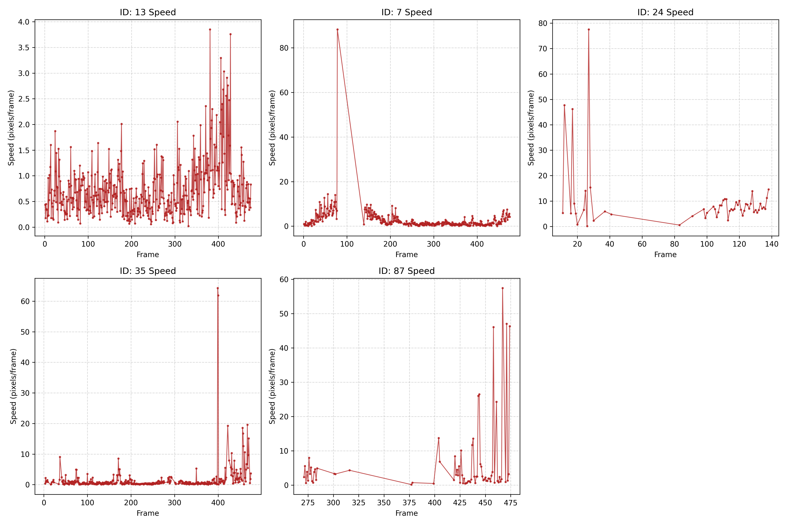

import os

# 追跡データにおける分析レポート

## 課題1：可視化・理解

### 1. 可視化した選手ID
本解析では、データ全体の中から追跡状態の対比を行うため、挙動が安定していると思われる選手1名と、移動速度に明らかな異常が確認された選手4名、計5名を選出して可視化した。

* **安定している選手（基準枠）**: ID: 13
* **異常が確認された選手**: ID: 7, ID: 24, ID: 35, ID: 87

### 2. 軌跡の図

### 3. 考察

#### ■ ID: 13（GK）
* **軌跡の特徴**: 画面右端の狭いエリアでコンパクトに動いている。
* **考察**:
  ID: 13は終始一定の狭いエリアに留まっており、安定して正常なトラッキングが行われている。

#### ■ ID: 7,24
* **軌跡の特徴**: ID:7では、中央付近で下に鋭く突き刺さるような不自然な直線が確認できる。ID:24では、途中で上方向急激に移動する異常な直線が現れ、その後データが途切れている。
* **考察**:
  ID:7は、不自然に鋭角なV字のジャンプが発生している。これは、選手が交差した際にターゲットを見失い、数フレーム後に離れた位置で再検出したためだと考えられる。ID:7に異常が現れた座標付近からID:24のトラッキングが開始しているため、ここで2選手のIDが入れ替わってしまったことが考えられる。

#### ■ ID: 35, 87
* **軌跡の特徴**: 画面の左下に2人が完全に固まっている。特にID: 87は、そこから1本だけ上に線が伸びる特異な挙動を示している。
* **考察**:
  ID:35とID:87は、画面左下の極小エリアに密集している。IDの激しい入れ替わりや誤検出を繰り返しているエラー状態であると推測される。

---

## 課題2：特徴量の改変

### 1. 追加した特徴量
選手一人ひとりの物理的な移動の妥当性を評価するため、フレーム間の移動量から速度を算出した。

* **速度（Speed）**: $[pixels/frame]$

### 2. 計算方法
選手（ID）ごとにデータをグループ化し、タイムラインに沿って前後のフレームの差分から算出した。

1. **中心座標（$cx, cy$）の計算**:
   与えられたバウンディングボックスの左上座標（$x, y$）と幅・高さ（$w, h$）から、選手の中心座標を求めた。
   $$cx = x + \\frac{w}{2}, \\quad cy = y + \\frac{h}{2}$$

2. **速度の計算**:
   1フレーム前からの中心座標の変化量（$vx, vy$）を算出し、三平方の定理を用いて1フレームあたりの移動距離（速度）を定義した。
   $$vx = cx_{t} - cx_{t-1}, \\quad vy = cy_{t} - cy_{t-1}$$
   $$Speed = \\sqrt{vx^2 + vy^2}$$

### 3. 速度についての考察

* **ID: 13**: 縦軸（Speed）を確認すると、他の選手が `60` や `80` まで跳ね上がっているのに対し、ID:13は最大でも 4.0 未満に収まっている。このことから、ID:13については正常かつ安定に追跡されていることがわかる。
* **ID: 7**: フレーム75付近において、速度が80を超える巨大なスパイクが発生している。その後、フレーム150にかけてなだらかな直線で速度が落ちており、見失った後で再認識している。
* **ID: 24**: フレーム25付近で速度が80近くまで急上昇するスパイクを記録した後、フレーム140以降のデータがプツリと途切れている。フレーム140付近ではID:7の選手が再認識されていることから、ID:7と誤認識されたのちに、完全に見失われていることがわかる。
* **ID: 35**: 終盤（フレーム400）までは速度がほとんど停止状態だったにもかかわらず、フレーム400を超えた瞬間に速度が60以上に急上昇している。
* **ID: 87**: フレーム275になるまでデータが出現せず、フレーム400付近に40〜60のスパイクが何度も連続で発生している。ID:35を考慮すると、画面左端に近接して存在する二人の選手について、２つのIDを交互に割り当ててしまっている可能性が考えられる。