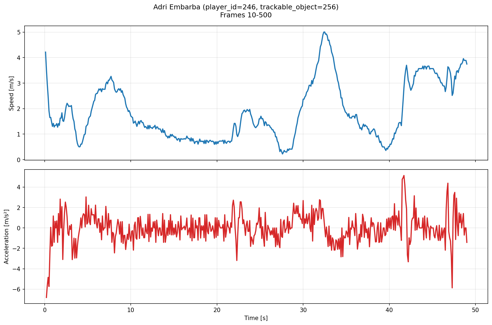

# ex1の課題

## 課題の概要

本課題では，SkillCornerのトラッキングデータを読み込み，サッカーのプレー状況を可視化する．
併せて，指定した選手の速度・加速度の変化を折れ線グラフで表示し，時系列データの扱いに慣れることを目的とする．

## 課題

1. SkillCornerのトラッキングデータを描画する
   - `data_path = /data_pool_1/laliga/skillcorner`
2. 指定選手の速度と加速度の折れ線グラフを表示する
3. ボールの軌跡を5フレーム残して表示する（応用）

## 課題の進め方

1. データを確認する
   - 選手・ボールの座標を確認する
   - 指定したmatch_idのファイルを読み込み，描画に使う情報を整理する
2. トラッキングデータを描画する
   - ピッチ上に選手とボールの位置を描画する
   - 軸や凡例などを必要に応じて付け，見やすい図にする

   <video src="./tracking_1018887_first100_1.mp4" controls muted playsinline width="720"></video>

3. 指定選手の速度・加速度を表示する
   - 1人の選手を指定し，位置の時間変化から速度と加速度を計算する
   - 時間に対する折れ線グラフとして表示する

   

4. 応用課題
   - ボールの現在位置だけでなく，過去5フレーム分の軌跡も描画する

   <video src="./tracking_1018887_first100.mp4" controls muted playsinline width="720"></video>

5. 発表に向けて整理する
   - 取り組んだ内容を周りに分かるように説明できるようにする
   - コードの説明はGitHubのページをそのまま使ってもよい

## ヒント

- Pythonを使う場合
  - データ処理：`numpy`, `pandas`
  - 描画：`matplotlib`
  - アニメーション：`matplotlib.animation`
  - サッカー描画のためのライブラリもある

## 注意

- スクリプトには適切にコメントを残すこと
- グラフの軸ラベルや凡例はできるだけ明記すること
- どの選手を対象にしたか分かるようにすること
- 応用課題までできなくても，まずは基本課題の完成を目指すこと
