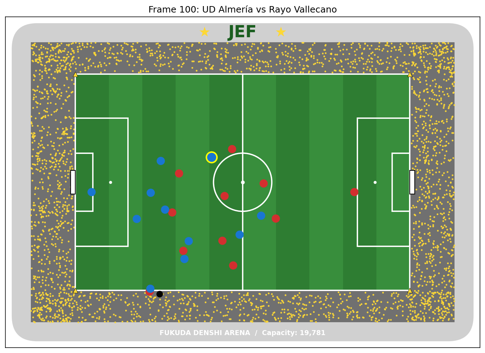
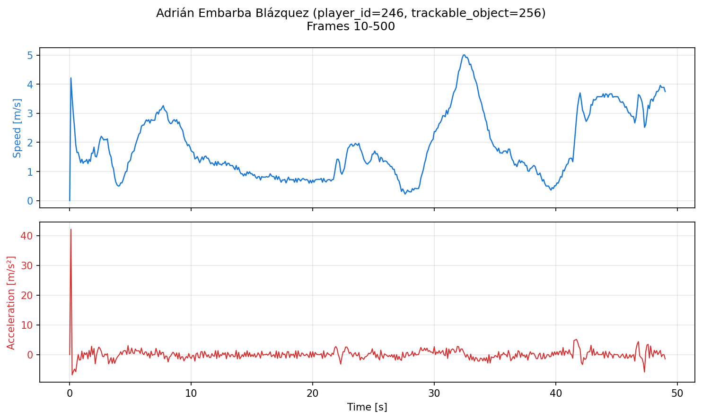

# What

ex1 の課題として、SkillCorner のトラッキングデータを可視化しました。
本実装では SkillCorner の La Liga 23 シーズンのデータ（match_id=1018887: UD Almería vs Rayo Vallecano）を使用しています。

実装内容:
1. ピッチ上に全選手とボールの位置を描画（地元のフクダ電子アリーナ風スタジアムにアレンジ）
2. 指定選手 (player_id=246, Adrián Embarba Blázquez) の速度・加速度を折れ線グラフで表示
3. 応用課題: ボールの軌跡を直近5フレーム残してアニメーション表示

## オリジナリティ

選手とボールが配置されるピッチを、ジェフユナイテッド千葉のホームスタジアムである
**フクダ電子アリーナ**を意識した見た目にアレンジしました。

- 球技専用スタジアムらしい、ピッチとスタンドが近い構造
- 角丸の屋根（フクアリの座席90%カバーを表現）
- 灰色の客席にジェフカラー（黄色）のサポーターを点描で表現
- 屋根中央に "★ JEF ★" のロゴ
- 芝の縦縞模様（実際のスタジアムのストライプ刈り）
- 4隅の黄色いコーナーフラッグ

# How to run

uv を使って実行します。事前に uv のインストールが必要です:
https://docs.astral.sh/uv/getting-started/installation/

```bash
uv sync
uv run main.py
```

実行すると、以下の3つの成果物が生成されます:
- `test_frame_fukuari.png` : フレーム100時点のピッチ＋選手＋ボール
- `player_246_speed_acceleration_10_500.png` : 速度・加速度の折れ線グラフ
- `tracking_1018887_frames_0_100.mp4` : 0〜100フレーム（10秒分）のアニメーション

# Results

## 1. トラッキングデータの描画（フクアリ風スタジアム）

フレーム100時点の選手・ボール配置。対象選手 (player_id=246) は黄色枠でハイライト。



## 2. 速度・加速度の折れ線グラフ

対象選手 Adrián Embarba Blázquez の Frame 10〜500（50秒間）の速度と加速度。
速度は最大で 5 m/s 程度（軽くダッシュ）、加速度は ±5 m/s² 程度の値を取っている。



なお、グラフ冒頭に加速度の大きなスパイクが見られるが、これは速度計算の初期値を　0 として扱った計算上のアーティファクトであり、実際の動きではない。

## 3. 応用課題: ボール軌跡付きアニメーション

ボールが移動した直近5フレーム分を、白い点として軌跡表示している。
古いものほど薄く小さく、新しいものほど濃く大きく描画することで、
ボールの動きの残像が直感的に見えるようにした。

<video src="./tracking_1018887_frames_0_100.mp4" controls muted playsinline width="720"></video>

# Implementation notes

## 速度・加速度の計算

SkillCorner のトラッキングデータは 10fps だったので、1フレームあたり dt=0.1秒。

- 速度: `sqrt((x_t - x_{t-1})^2 + (y_t - y_{t-1})^2) / dt`
  ピタゴラスの定理で1フレーム間の移動距離を出し、時間で割る
- 加速度: `(speed_t - speed_{t-1}) / dt`
  速度の差分を時間で割る

numpy の `np.diff` で差分計算、`prepend` で配列長を揃えている。

## ボール軌跡の実装

`collections.deque(maxlen=5)` を使って、過去5フレーム分のボール位置を保持。新しい位置を追加すると古い位置が自動的に削除されるため、軌跡管理が簡潔になる。描画時は `np.linspace` でアルファ値・サイズの配列を作り、古いものほど薄く小さく表示（消えていく仕様）。

# 環境

- Python 3.11+
- numpy
- matplotlib
- tqdm
- ffmpeg (mp4出力用、システムにインストール済みであること)