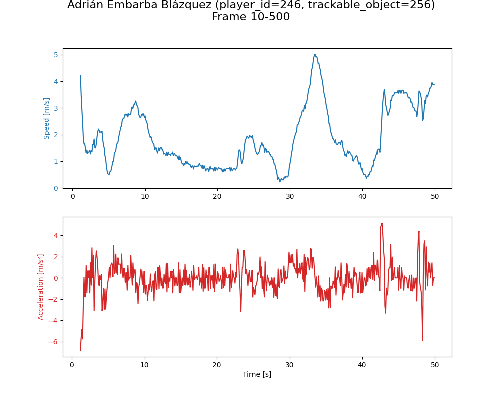

# What

Implemented soccer tracking data visualization using SkillCorner data as per ex1 requirements.
This pull request includes:
1. Drawing player and ball positions on the pitch.
1. Plotting speed and acceleration for a specified player.
1. Optionally, showing the ball's trajectory with a 5-frame trail.

This work use uv as python project manager. Please make sure uv is installed and configured in your environment. You can run following commands to set up the environment and run the code:

```bash
uv sync
uv run main.py
```

# Results

1. Tracking Data Visualization:
   - Created an animation showing the movement of players and the ball.
   - Implemented ball trail visualization for the last 5 frames.
   - The animation is saved as "match_1018887_tracking.mp4".
<video src="./match_1018887_tracking.mp4" controls muted playsinline width="720"></video>

2. Speed and Acceleration Plot:
   - Calculated speed and acceleration for player_id 246.
   - Plotted speed and acceleration over time (10 to 500 frames).
   - The resulting graph is saved as "player_246_speed_acceleration_10_500.png".


