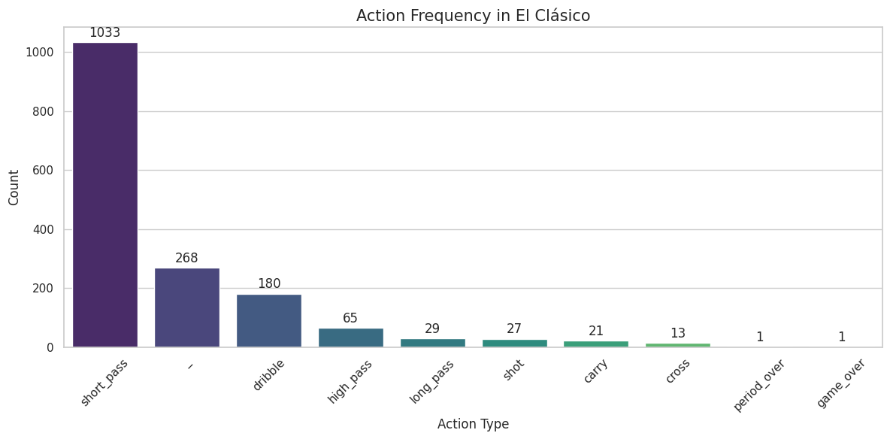
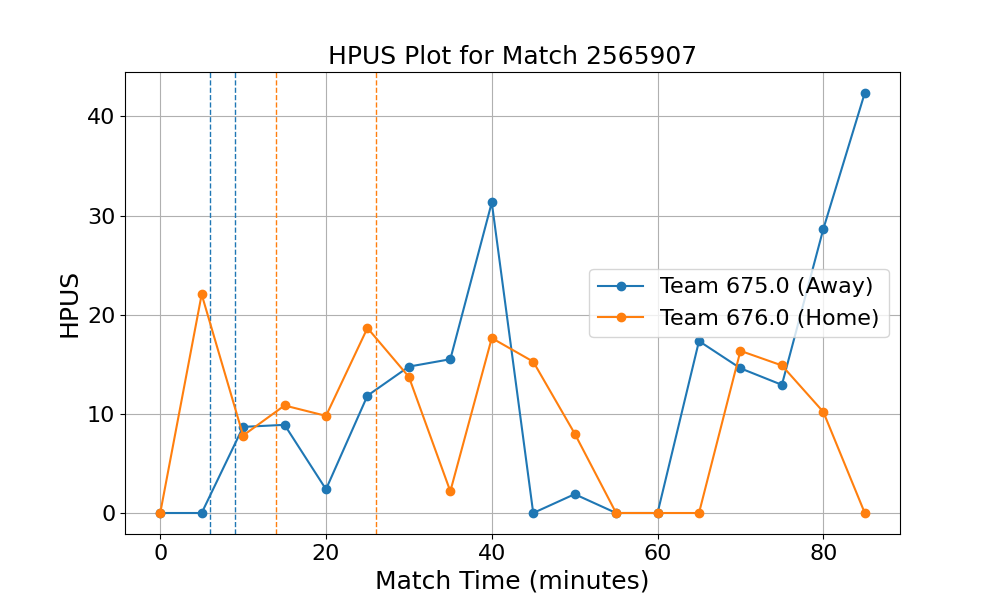
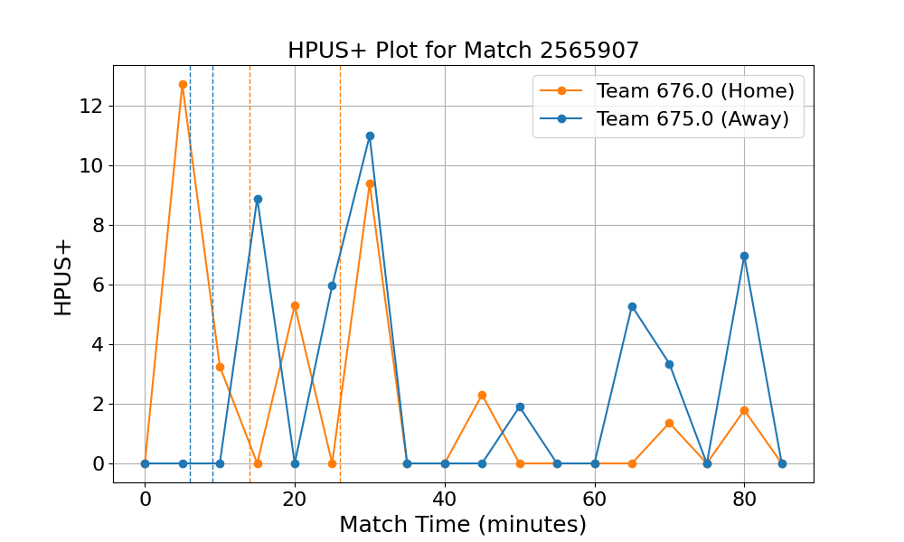

# Exercise 3: 前処理の変更と既製モデルによる試合分析

## 課題1：前処理の変更

### 残したリーグと，変更した処理の説明
- 残したリーグ：Spain＝La Liga
- 変更した処理：
    `subprocess.run(['rm', '-rf', 'event/events_Spain.json'])`と`subprocess.run(['rm', '-rf', 'matches/matches_Spain.json'])`をコメントアウトし、`subprocess.run(['rm', '-rf', 'event/events_England.json'])
    `と`subprocess.run(['rm', '-rf', 'matches/matches_England.json'])`を実行するように変更した。

### 再前処理した `data.csv` の概要（試合数・行数など）
380試合、549,357行、22列のデータが含まれている。
各行には、`action`, `success`, `goal` , `dist2goal`, `angle2goal` などが含まれている。

## 課題2・3：試合の選択と推論

### 選んだ `match_id`（対戦カードを明記）
`match_id = 2565907`（クラシコ：FC Barcelona vs Real Madrid）

### 推論に使った設定
事前学習済みモデルを使用した。

### loss_df
| train_loss | CEL_action | RMSE_deltaT | RMSE_location | ACC_action | F1_action | MAE_deltaT | MAE_x | MAE_y |
| :---: | :---: | :---: | :---: | :---: | :---: | :---: | :---: | :---: |
| 4.6826 | 1.0258 | 0.2263 | 0.2525 | 0.701 | 0.1679 | 3.0806 | 7.1074 | 16.6125 |

## 課題4：可視化分析

### 試合中のアクション頻度
選んだ試合におけるアクションの頻度は以下の通りである。アクションの大部分は `short_pass` であることがわかる。次いで `dribble`, `high_pass`, `long_pass` が多く、パス関連のアクションが大半を占めている。

### HPUS
ホームチーム（Real Madrid）とアウェイチーム（FC Barcelona）のHPUSの推移を以下に示す。オレンジがホームチーム、青がアウェイチームである。
まずホームチームに注目すると、開始直後にピークを迎え、30分ごろまではアウェイチームより高いHPUSを維持していることがわかる。35分頃には一度急落するが、その後は上昇と下降を繰り返し、試合終了間際には0になっている。一方、アウェイチームは開始直後から徐々にHPUSが上昇し、40分頃にピークを迎える。その後60分頃まではHPUSがほとんど0に近い状態が続くが、65分頃から再び上昇し、試合終了間際には最大値を記録している。全体的に見ると、ホームチームは試合序盤に高いHPUSを示したが、その後は約10分ごとにHPUSの優劣が入れ替わる展開となっている。終盤は、ホームチームのHPUSは低下している一方、アウェイチームは大きく上昇している。

### HPUS+
HPUSと同様、ホームチーム（Real Madrid）とアウェイチーム（FC Barcelona）のHPUS+の推移を以下に示す。オレンジがホームチーム、青がアウェイチームである。
全体として前半の30分過ぎまでに両チームの複数のピークが集中しており、35分から60分の中盤にかけては両者ともに0付近で数値が低迷し、終盤に再びHPUS+の値が上下している。
ホームチームの推移を見ると、試合開始直後の5分時点で12を超える最大値を記録し、急激な増減を繰り返しながら20分、30分ごろにもピークをとっている。35分以降は、軽微な変動はみられるものの、0付近で低迷している。
一方のアウェイチームは、前半10分までは0のまま推移しているが、15分頃に約9、30分ごろに約11と、それぞれ急激な上昇を見せている。からピークに達している。35分から60分頃にかけては0付近で低迷しているが、65分頃から再び上昇し、65分、80分ごろにピークをとっている。

### 考察
実際のイベントデータから、本試合では10分と67分にホームチームが、15分と87分にアウェイチームがゴールを決めていることがわかっている。
試合開始直後、ホームチームのHPUSとHPUS+はともに高い値を示しており、序盤からホームチームが敵陣で質の高いポゼッションを行ったことがうかがえる。10分のゴールはこの序盤の優位な展開の結果であった可能性がある。
一方、アウェイチームは前半15分頃にHPUS+がピークを迎えており、これは15分のゴールに繋がった可能性がある。このタイミングのHPUSは比較的低い値であったことから、ポゼッション自体は少ないが、少ない手数やカウンターから極めて効率的にゴールを奪ったと考えられる。
35分から60分ごろにかけては、HPUSはゼロではないのに対してHPUS+は0付近で低迷していることから、それぞれポゼッションがあったものの、シュートなど決定的なアクションにつながらなかったと推察できる。
67分のホームチームのゴール時や87分のアウェイチームのゴール時にはそれぞれのHPUSが上昇しており、試合展開を反映していると考えられる。しかし、HPUS+は低い値にとどまっていることから、HPUS+が試合内容と整合していないように見える。この理由は今回の結果のみからでは推察が難しく、実際の試合映像を確認するなどして、両ゴールの前後の展開を分析する必要がある。